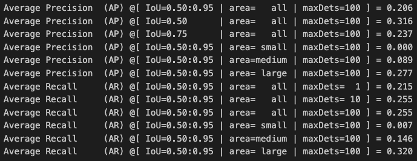

# Vehicle Detection using Faster R-CNN

이 프로젝트는 Faster R-CNN을 사용하여 버스와 트럭을 탐지하는 객체 탐지 모델을 구현합니다.

## 프로젝트 개요

- 버스와 트럭 두 가지 클래스에 대한 객체 탐지
- Faster R-CNN (ResNet50 FPN backbone) 사용
- PyTorch 기반 구현
- COCO format 평가 지표 사용

## 설치 요구사항
```bash
pip install torch torchvision
pip install opencv-python
pip install pandas numpy matplotlib
pip install pycocotools
```

## 데이터셋 구조
```
Detection/
├── images/
├── train/
├── val/
├── df.csv
└── val.json
```

## 주요 기능

1. **데이터셋 구축**
   - Bus와 Truck 클래스에 대한 탐지 데이터셋
   - COCO format 기반의 바운딩 박스 좌표계 사용
   - Train/Val 분할

2. **모델 구현**
   - Faster R-CNN
     - ResNet50 FPN backbone 사용
     - Region Proposal Network (RPN)
     - ROI Pooling
   - YOLOv1
     - Grid 기반 단일 스테이지 탐지기
     - 격자당 2개의 바운딩 박스 예측

3. **학습**
   - SGD optimizer (lr=0.001, momentum=0.9)
   - 30 epochs
   - 배치 사이즈: 6

   

4. **후처리**
   - Confidence threshold
   - Non-maximum suppression (NMS)
   - COCO metrics 기반 성능 평가

5. **평가**
   - COCO evaluation metrics
   - 실시간 비디오 추론 지원

## 사용 방법

1. 모델 학습:
```python
dataloaders = build_dataloader(data_dir=data_dir, batch_size=BATCH_SIZE, image_size=IMAGE_SIZE)
model = build_model(num_classes=NUM_CLASSES)
```

2. 추론:
```python
model = load_model(ckpt_path='./trained_model/model_30.pth', num_classes=NUM_CLASSES, device=DEVICE)
prediction = model_predict(image, model)
```

3. 비디오 테스트:
```python
vid = cv2.VideoCapture(video_path)
```
# 비디오 프레임별 추론 실행


## 성능 평가

- COCO metrics 사용
- 다양한 객체 크기에 대한 평가 (small, medium, large)
- 실시간 처리 속도 측정



### 2. 커스텀 크기 기반 평가
객체 크기에 따른 세분화된 성능 평가를 위해 다음과 같은 커스텀 area ranges를 적용했습니다:
- 작은 객체: 면적 < 400 픽셀
- 중간 객체: 400 <= 면적 < 10000 픽셀
- 큰 객체: 면적 >= 10000 픽셀

각 평가는 다음 메트릭을 포함합니다:
- Average Precision (AP) @ IoU=0.50:0.95
- AP @ IoU=0.50
- AP @ IoU=0.75
- AP for small/medium/large objects
- Average Recall (AR) for different detection counts and object sizes